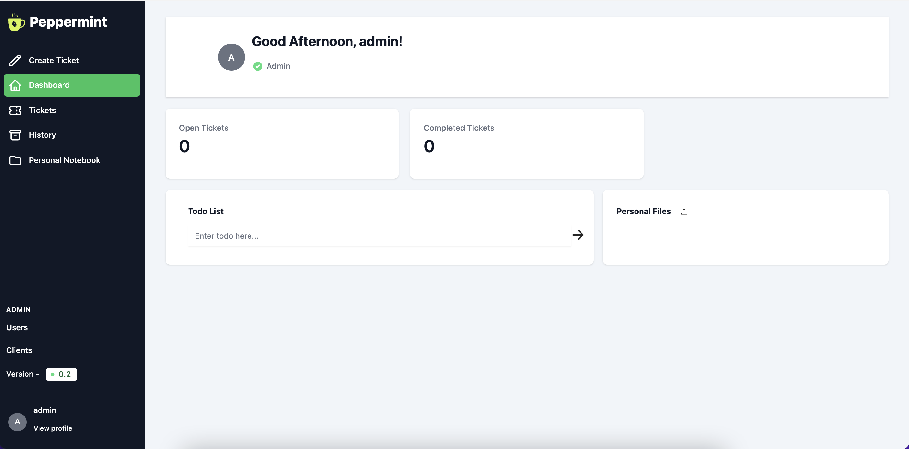
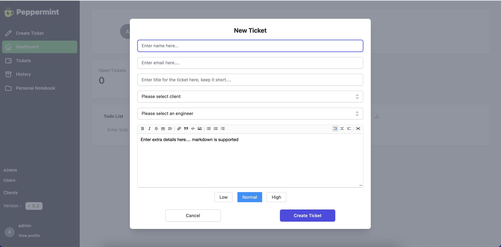
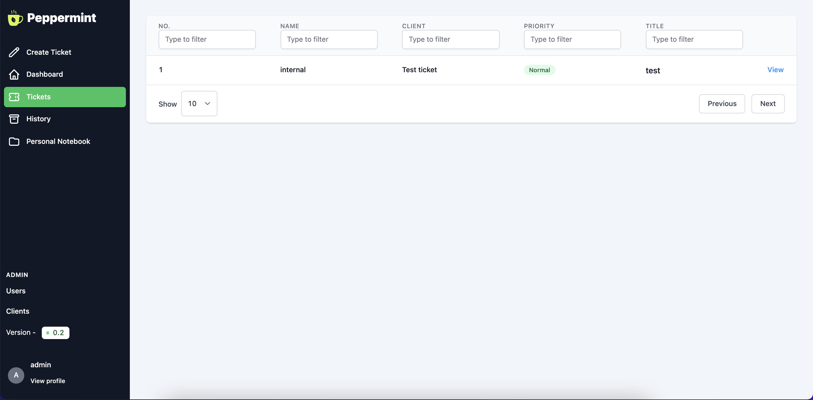
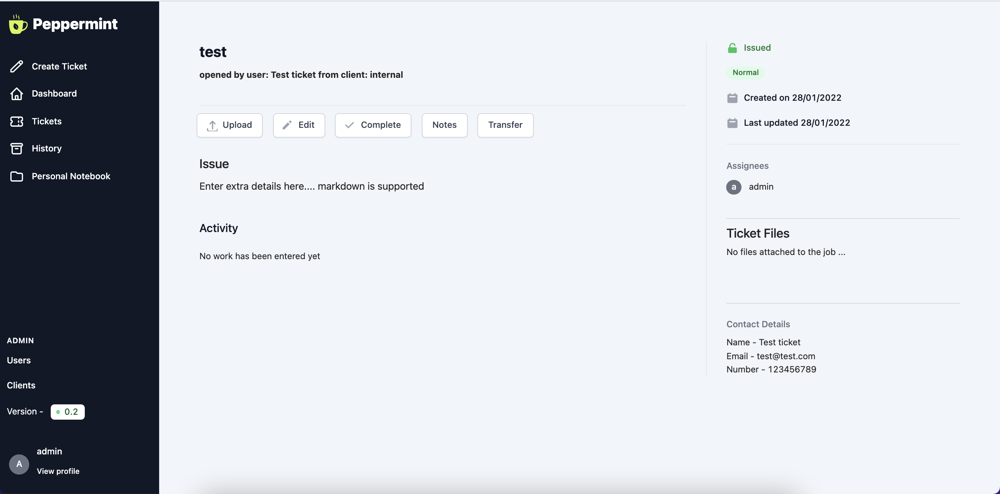

<h1 align="center">Welcome to Peppermint Ticket Management 🍵</h1>


> Ticket Management System in order to help helpdesks & service desks manage internal staff & customer requests

## Introduction

It's a self hosted alternative to popular services such as zendesk



## ✨ Features

- **Ticket Creation**: Bog standard ticket creation with a markdown editor and file uploads
- **A log of client history**
- **Markdown based Notebook with todo lists**
- **Responsive**: Designed for variable screen sizes from mobile up to 4k
- **Multi-deployment**: Quickly deploy using docker & pm2
- **Simple to Use**: Designed to be easy to use with a simple logical workflow

## 🐳 Installation with docker

Check out the getting started guide if this is the first time you've used Peppermint:

```
version: "3.1"

services:
  postgres:
    container_name: postgres
    image: postgres:latest
    restart: always
    volumes:
      - ./docker-data/db:/data/db
    environment: 
      POSTGRES_USER: peppermint
      POSTGRES_PASSWORD: 1234
      POSTGRES_DB: peppermint

  client:
    container_name: peppermint
    image: pepperlabs/peppermint:latest
    ports:
      - 5000:5000
    restart: on-failure
    depends_on:
      - postgres
    environment:
      PORT: 5000
      DB_USERNAME: peppermint
      DB_PASSWORD: 1234
      DB_HOST: 'postgres'
      BASE_URL: "http://localhost"

```

Once this is completed then you can go to your base_url which was added to the compose file and login.

The default login credentials are
```
admin@admin.com
1234
```

## Motivation

- This was initially a project to tie together my react and nodeJS skills and show something for my portfolio
- It looked terrible! But it worked and showed functionaility, which got me a job.
- Learn and deploy with docker
- Redo the UI, completly from the ground up. Which has now been completed and for me looks great.
- Build on this foundation and create a fully fledged product which offers what the big boys offer, but, at a much better ROI than signing up for zendesk etc.

Give a ⭐️ if this project helped you!

## Screenshots

<p align="center">
    
    
    
    
</p>
